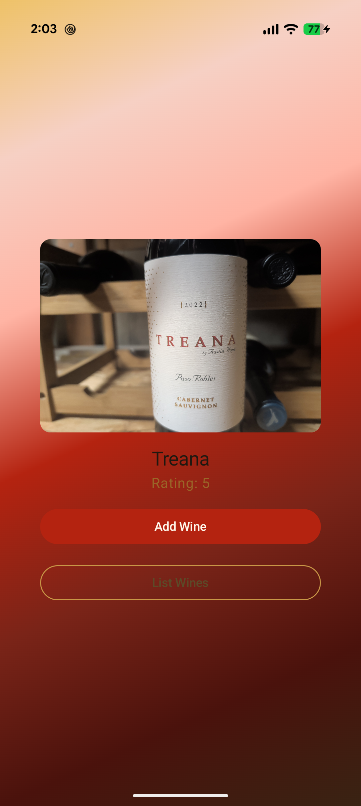
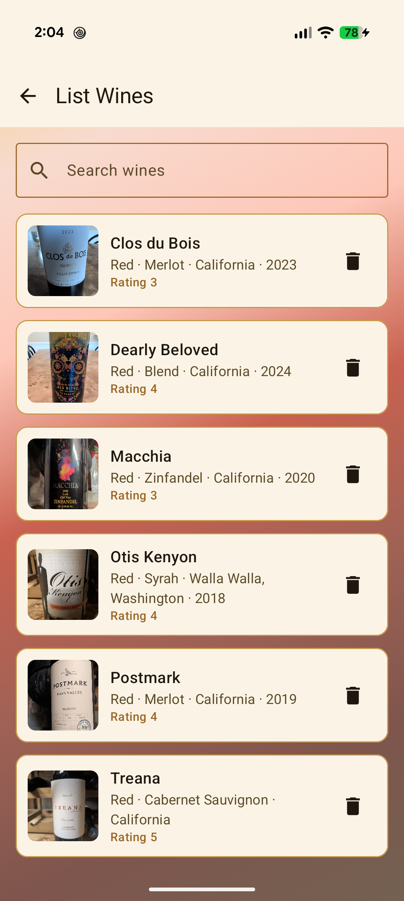
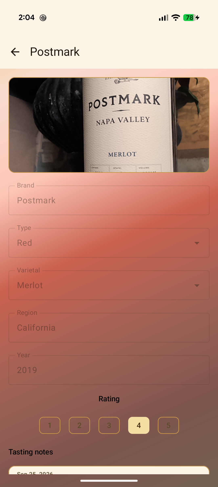

# LeWineSnob

Android wine journal for logging bottles, ratings, photos, and tasting notes.

## Features

- **Home** — a random bottle from the cellar (photo, brand, rating), plus shortcuts to add or list wines
- **Add wine** — brand, type, varietal, region, vintage, 1–5 rating, bottle photo (camera or gallery), and tasting notes
- **Duplicate check** — saving a wine with the same brand, year, varietal, and type prompts you to see the original, save anyway, or keep editing
- **List wines** — searchable cellar; tap a bottle to view it, or delete it (notes and photo go with it)
- **View wine** — details are read-only except rating and adding another tasting note

All data is stored on the device with Room. Photos are copied into app storage so they survive after the gallery URI expires.

## Screenshots

### Home



### List wines



### Wine details



## Requirements

- Android Studio (AGP 9.2 / Gradle 9.4)
- JDK 11+
- Device or emulator running **API 24+**

## Build and run

Open the project in Android Studio and run the `app` configuration, or:

```bash
./gradlew :app:installDebug
```

## Data

Package ID: `net.aucutt.lewinesnob`

| Table | Fields |
| --- | --- |
| `wines` | id, brand, type, varietal, region, year, rating, imageUri |
| `tasting_notes` | id, wineId (FK, cascade delete), date, notes |

SQLite file on a device/emulator:

```
/data/data/net.aucutt.lewinesnob/databases/lewinesnob.db
```

Inspect it while the app is running with **Android Studio → App Inspection → Database Inspector**, or pull the file and open it in [DB Browser for SQLite](https://sqlitebrowser.org/).

Bottle photos live in:

```
/data/data/net.aucutt.lewinesnob/files/wine_photos/
```

## Stack

Jetpack Compose, Material 3, Navigation Compose, Room, Kotlin 2.2.
